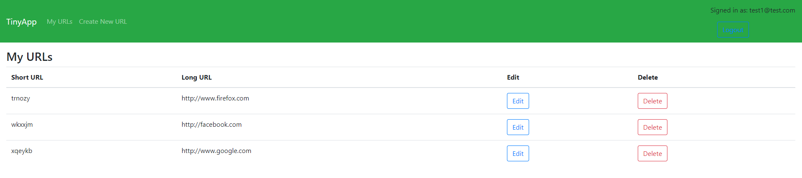
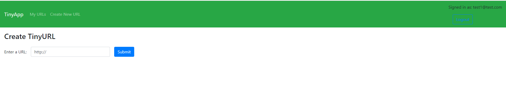
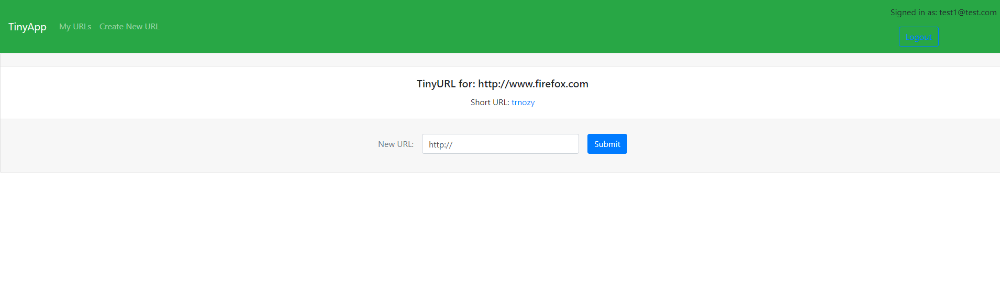

# TinyApp Project

TinyApp is a full stack web application built with Node and Express that allows users to shorten long URLs similar to (bit.ly).

## Final Product

  

## Dependencies

- Node.js
- Express
- EJS
- bcryptjs
- body-parser
- cookie-session

## Getting Started

- Install all dependencies (using the `npm install` command).
- Run the development web server using the `node express_server.js` command.
- Go to localhost:8080 on your browser, and enjoy!

## How To Use TinyApp

### **Register**

Registration can be found on the top right or simply by typing http://localhost:8080/register

### **Creating New Links**

Via the navbar, click on Create New URL, enter a link that you would like to shorten. To see a complies list of all your URLs, click on the TinyApp nav bar.

### **Editing Links**

To edit/update your URL, click on the edit button, which will take you to a page where you can update your URL.
